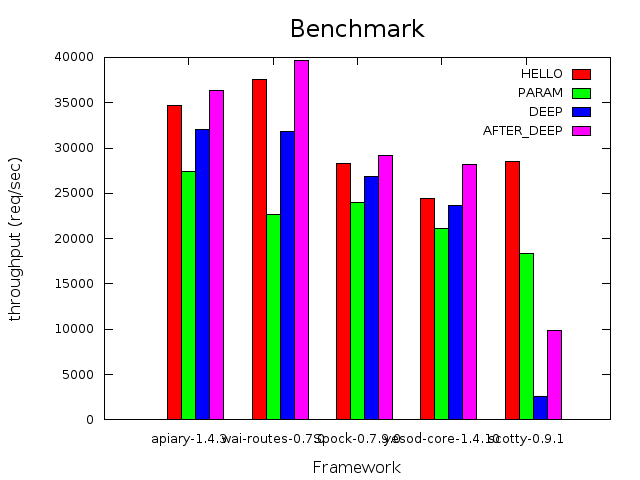

[Wai-Routes](https://ajnsit.github.io/wai-routes)    
====================================

Wai-routes is a micro web framework for Haskell that focuses on typesafe URLs.

Wai-routes is based on the Haskell [Web Application Interface](http://hackage.haskell.org/package/wai) and uses it for most of the heavy lifting. It also provides a convenient but thin veneer over most of the wai API so it is unnecessary to directly use raw wai APIs when building web apps.

Much of Wai-route's typesafe URL functionality was pulled from the corresponding features in [Yesod](http://www.yesodweb.com/), and indeed the underlying aim of wai-routes is - *"To provide a similar level of typesafe URL functionality to Wai applications as is available to Yesod applications."*.

Features
==========

Wai-routes adds the following features on top of wai -

  - Typesafe URLs, including automatic boilerplate generation using TH. Including features such as -
    - Nested Routes
    - Subsites
    - Route Annotations
  - Sitewide Master data which is passed to all handlers and can be used for persistent data (like DB connections)
  - Easy to use Handler Monad which allows direct access to request and master data
  - Easy composition of multiple routes and middleware to construct an application
  - Ability to abort processing and pass control to the next application in the wai stack
  - Streaming responses

Performance
===========

When it comes to performance, Wai-routes compares quite favorably with other Haskell web development micro frameworks.

See more details here - [philopon/apiary-benchmark](https://github.com/philopon/apiary-benchmark)

Example Usage
=============

Wai-routes comes with several examples in the `examples/` directory. New examples are being added regularly.

**Example 1. Hello World** - [Code](examples/hello-world)

A simple hello-world web app with two interlinked pages. This provides the simplest example of using routing and linking between pages with typesafe routes.

**Example 2. Hello World with Subsites** - [Code](examples/subsites)

Similar functionality as the first example, but uses a hello world subsites to provide the hello world functionality. A subsite is an independently developed site that can be embedded into a parent site as long as the parent site satisfies a particular api contract. It's easy to swap out subsites for different functionality as long as the api contract remains constant.

**Example 3. Using Blaze-HTML to generate HTML** - [Code](examples/blaze-html)

A simple example of how to generate HTML using blaze-html combinators in your handlers.

**Example 4. Using Shakespearean Templates (hamlet, cassius, lucius, julius) to generate HTML/CSS/JS** - [Code](examples/shakespeare)

A simple example of how to generate HTML/CSS/JS using shakespearean templates. You can use both external and inline templates.

**Example 5. Building a JSON REST Service** - [Code](examples/rest-json)

Provides a simple example of how to build JSON REST services with wai-routes. Uses Aeson for JSON conversion. Note that this example just demonstrates the web facing side of the application. It doesn't permanently persist data, and is also not threadsafe. You must use a more robust data storage mechanism in production! An example of doing this with a Relational DB adapter (like persistent) is in the works.

**Example 6. Stream a response** - [Code](examples/streaming-response)

Wai has had the ability to stream content for a long time. Now wai-routes exposes this functionality with the `stream` function. This example shows how to stream content in a handler. Note that most browsers using default settings will not show content as it is being streamed. You can use "curl" to observe the effect of streaming. E.g. - `curl localhost:8080` will dump the data as it is being streamed from the server.

Planned Features
====================

The following features are planned for later releases -

- Support for raw network responses (see http://hackage.haskell.org/package/wai-3.0.3.0/docs/Network-Wai.html#v:responseRaw)
- Seamless websocket support
- Development mode
- Keter and Heroku support
- Scaffolding
- Better documentation
- Tests and code coverage

Changelog
=========

* 0.8.0 : Replaced 'show/renderRoute' with 'show/renderRouteSub' and 'show/renderRouteMaster'. Added functions to access request headers (reqHeader/s), send a part of a file (filepart). Auto infer mime-types when sending files. Added cookie handling functions (get/setCookie/s). Added 'sub' to allow access to subsite datatype.
* 0.7.3 : Added 'stream' to stream responses. Added 'asContent', 'css', and 'javascript' functions.
* 0.7.2 : Added 'file' to send a raw file directly, 'rawBody' and 'jsonBody' to consume request body. Refactored RouteM to add 'catchAll' and 'waiApp'.
* 0.7.1 : Added 'showRouteQuery', renamed 'text' to 'plain', 'html' now accepts Text instead of ByteString
* 0.7.0 : Subsites support added
* 0.6.2 : Added 'maybeRoute' and 'routeAttrSet', to get information about the currently executing route
* 0.6.1 : Fixed cabal and travis files
* 0.6.0 : Removed dependency on yesod-routes. Updated code to compile with wai-3 and ghc-7.8, ghc-7.10
* 0.5.1 : Bumped dependency upper bounds to allow text 1.*
* 0.5.0 : Added raw,text,html,json helpers. Update to wai-2.1.
* 0.4.1 : showRoute now returns "/" instead of ""
* 0.4.0 : Wai 2 compatibility. Replaced 'liftResourceT' with 'lift'
* 0.3.4 : Added 'liftResourceT' to lift a ResourceT into HandlerM
* 0.3.3 : Better exports from the Network.Wai.Middleware.Routes module
* 0.3.2 : Added HandlerM Monad which makes it easier to build Handlers
* 0.3.1 : Removed internal 'App' synonym which only muddied the types. Added common content types for convenience.
* 0.3.0 : yesod-routes 1.2 compatibility. Abstracted request data. Created `runNext` which skips to the next app in the wai stack
* 0.2.4 : Put an upper bound on yesod-routes version as 1.2 breaks API compatibility
* 0.2.3 : Implemented a better showRoute function. Added blaze-builder as a dependency
* 0.2.2 : Fixed license information in hs and cabal files
* 0.2.1 : Changed license to MIT
* 0.2   : Updated functionality based on yesod-routes package
* 0.1   : Intial release
